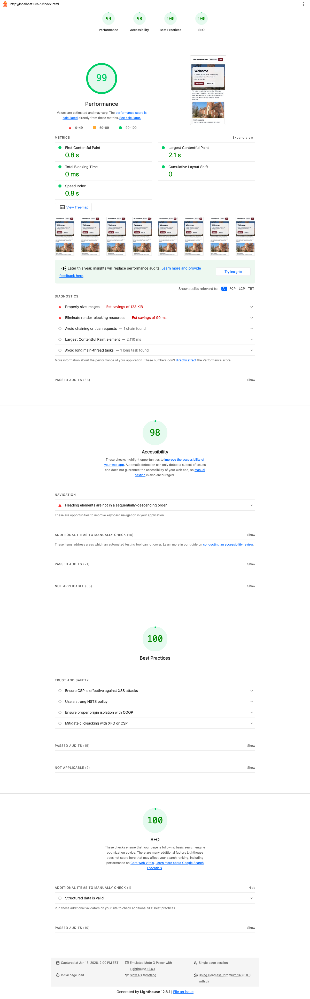

# First Springfield Church Website

This repo hosts the new Church site built with Astro (see the `web/` directory for the full frontend). It targets Cloudflare runtime and keeps its own performance budgets in CI so you can ship confidently.

## Getting started

1. `cd web`
2. `npm install`
3. `npm run dev`

The rest of the scripts live inside `web/package.json`; `npm run build` produces a static output in `web/dist` and `npm run preview` lets you inspect the result locally.

## Performance budget (Lighthouse CI)

We enforce a small performance budget in CI to prevent regressions:
- Performance score must stay at or above 0.90
- Accessibility score must stay at or above 0.95
- Best Practices score must stay at or above 0.95
- SEO score must stay at or above 0.95

Why: budgets catch “death by a thousand cuts” (unoptimized images, heavy scripts, accidental layout shifts) before they reach production. Lighthouse category assertions operate on a 0–1 scale in CI configs, so 0.90 corresponds to “90/100 style” expectations.

Config: `web/lighthouserc.cjs`.
How to run locally: `npm run lighthouse` (from the `web/` folder).
