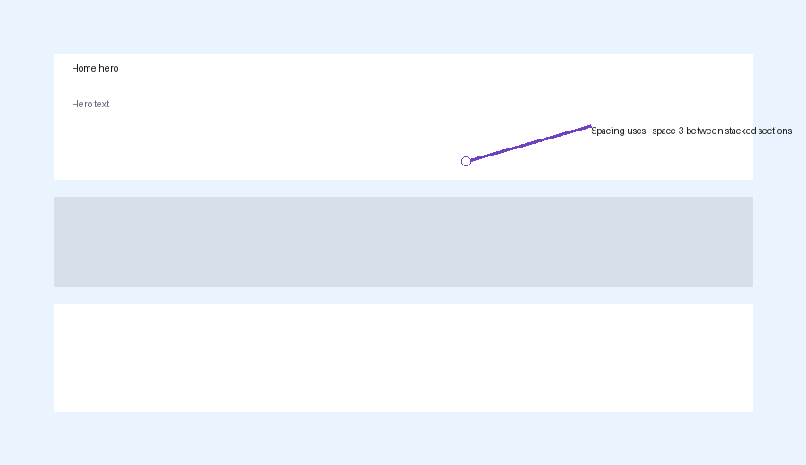
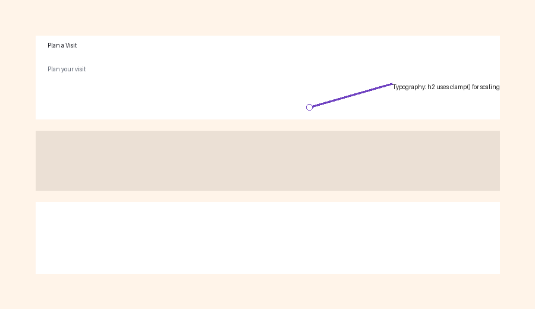
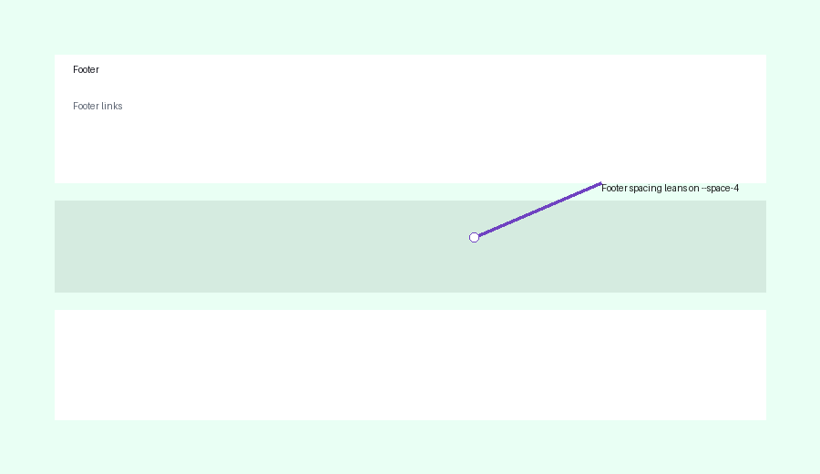

# UI Handoff - First Springfield SDA Website

## 1) Design goals
- Calm, readable, welcoming tone with generous breathing room and restrained color.
- Mobile-first layout, fast loads, minimal JS (Astro SSR + partial hydration only where necessary).
- Accessible interactions: clear focus-visible rings, 44px+ tap targets, text that reads well across screen sizes.

## 2) Breakpoints (responsive rules)
Source of truth: `web/src/styles/global.css`.
- Base: mobile-first stack — `.stack`, hero, cards, and nav all stack vertically using tokens so there is no media query assumption.
- `@media (max-width: 860px)`: hides desktop `nav`/`cta` stacks, surfaces the mobile `details.menu`, and tightens `.main` padding to `var(--space-6)` while keeping all sections legible.
- `@media (max-width: 520px)` and `(max-width: 420px)`: collapse footer columns into single-column flow and hide the menu label to preserve tap area while keeping the icon visible.

## 3) Spacing scale (tokens)
Source of truth: `web/src/styles/tokens.css`.

| Token | Intended use | Examples |
|------|--------------|----------|
| `--space-1` | micro gaps or icon/text separation | `header .brand` gap, `.footer-contact` stack spacing |
| `--space-2` | petite padding between inline elements | button gutters, card subtitle margin, `.col-body` link spacing |
| `--space-3` | standard rhythm between sections | `.stack` spacing, hero actions gap, mobile nav spacing |
| `--space-4` | generous separation / nested stacks | hero-inner gap, `.hero` vs hero background, `grid` gap |
| `--space-6` | card padding or section padding inside containers | `.card` padding, `.inner` padding top/bottom, footer body padding |
| `--space-8` | container padding and major vertical gaps | `.main` padding, `Header` inner padding, `.stack--loose` |
| `--space-12` | extra-wide sections if/when needed | large hero spacing or future horizontal rules |

Implementation notes:
- Import tokens once (`@import "./tokens.css"`) and reference via `var(--space-*)` to keep vertical rhythm consistent.
- Use `.stack`, `.grid`, and `.cluster` utility classes from `global.css` so spacing scales with the same token set rather than hard-coded px values.

## 4) Typography scale (global rules)
Source of truth: `web/src/styles/global.css`.
- Base `body` font size is `var(--font-size-1)` (1rem) with a 1.6 line-height.
- Headings rely on `clamp()` for responsiveness:
  - `h1`: clamp(2.2rem, 1.6rem + 2.4vw, 3.2rem) for hero-level impact.
  - `h2`: clamp(1.6rem, 1.2rem + 1.6vw, 2.4rem) for section headers.
  - `h3`: clamp(1.25rem, 1.05rem + 1vw, 1.7rem) for subsections.
- Paragraphs and lists are capped at 70ch to hit the 60–80ch readability target.
- Hero component overrides `h1` (`clamp(2.4rem ... 3.5rem)`) and adds a `muted` subtitle with its own clamp.

## 5) Color + elevation
Source of truth: `web/src/styles/tokens.css`.
- Surfaces: `--color-bg`, `--color-surface`, `--color-surface-2`, and `--color-surface-muted` keep backgrounds and cards light.
- Text: `--color-text`, `--color-text-muted`, `--color-primary`, `--color-primary-hover`, and `--color-focus` drive links, CTAs, and focus outlines.
- Borders use `--color-border` / `--color-border-strong` with consistent `--radius-*` rounding (cards, buttons, menu, footer).
- Elevation: `--shadow-1` for cards, `--shadow-2` for hover states (cards, menu panel), no complex layering keeps performance predictable.

## 6) Components catalog (what exists + how to use)
### Button
File: `web/src/components/ui/Button.astro`
- Variants: `primary` (solid key actions), `secondary` (light background, dark border), `ghost` (transparent, outlines), plus implicit text/inline usage through `ButtonLink`.
- Sizes: `sm`, `md`, `lg` adjust font-size (vars `--font-size-0..2`) and padding (`--space-2..6`).
- States:
  - `hover`: darkens (`--color-primary-hover`) or swaps to gray hover fills.
  - `focus-visible`: global `outline: 3px solid var(--color-focus)` via `global.css` keeps keyboard nav visible.
  - `disabled`: not styled explicitly, so rely on native browser styling; add `disabled` prop before applying `Button` for future needs.
- Uses `var(--space-2)` for gaps and ensures `min-height: var(--target-min)` for 44px tap targets.

### Card
File: `web/src/components/ui/Card.astro`
- Reused for service cards, announcements, and hero wrapper (`<section class="hero card">`).
- Provides `card`/`card--link` classes defined globally (background, border, radius, shadows) and tailored title/description text.
- Outline: `card__title` uses `--font-size-2`, `card__desc` uses `muted` color, and CTAs reuse `.link` styling for hover/focus.

### Hero
File: `web/src/components/ui/Hero.astro`
- Wraps title/subtitle + CTA buttons in `.hero.card` to reuse card surface rules.
- `hero__inner` grid uses `--space-4`; `hero__title` and `hero__subtitle` each define their own `clamp()` scalings.
- CTA stack uses `--space-3` so buttons align vertically on mobile yet stay horizontal when space is available.

### Header / Nav
File: `web/src/components/global/Header.astro`
- Brand link + nav items are laid out in a 3-column grid inside `.inner` with container padding/token values.
- Desktop nav vs mobile menu (`details.menu` + `.menu__panel`), including quick actions derived from `site.quickActions`.
- Nav links highlight active route (`aria-current`) and use `var(--space-2)` gaps, so `--space-3` spacing between the nav cluster and CTA group.
- Mobile menu uses `var(--shadow-2)` and `--radius-3` to match overall surface language; event listener closes menu when selecting a link.

### Footer
File: `web/src/components/global/Footer.astro`
- Two-part layout: info column + nav grid, all inside `.inner` with `var(--space-6)` padding.
- Uses `.links` helper and `var(--space-2)` gap to keep links stacked, and `@media (max-width: 520px)` collapses columns to full width.
- Includes dynamic sections (primary/exploratory nav, quick actions, service times) sourced from `site.nav`, `site.quickActions`, and `site.schedule`.

## 7) Accessibility checklist (project expectations)
- Keyboard navigation: global `a:focus-visible`, `button:focus-visible`, and `summary:focus-visible` outlines defined in `global.css` for consistent focus states.
- Skip link (`.skip-link`) is available globally and reveals itself on focus so screen-reader/keyboard users can jump straight to `.main`.
- Tap targets: `--target-min` enforces 44px+ heights for buttons, nav pills, menu links.
- Semantic text: `heading` scalings, `muted` helpers, and list height constraints keep readability high, and `Hero` CTA order remains logical.
- Images (e.g., `Hero` and CTA icons) should always include `alt` text from the content source; decorative elements rely on empty `alt`.

## 8) “Design-to-code” notes
- Tokens live in `web/src/styles/tokens.css` and are the single source for spacing, color, radius, and typography values.
- Components (`Button`, `Card`, `Hero`, `Header`, `Footer`) rely on tokens instead of raw px to preserve rhythm as screen widths change.
- Responsive rules mirror tokens: `.stack`, `.grid`, `.container`, and media queries share numeric values from the tokens file for predictable scaling.
- Animations/transitions are minimal (`120–160ms ease`) and tied to hover/focus states in `global.css`; keep new interactions aligned with that timing.

## 9) Screenshots & callouts
-  Spacing uses `--space-3` between stacked sections, matching the `.stack` gap in `global.css`.
-  Typography: `h2` uses `clamp()` to scale with viewport width (`global.css`).
-  Footer spacing leans on `--space-4`/`--space-6` to keep columns breathing and align with the header container.

## 10) Decision log
- Why Astro: content-first rendering with partial hydration keeps the site fast and lets us pull in Markdown/data without heavy bundling.
- Why tokens: centralized spacing/color/typescale means any new component can reuse variables instead of uncoordinated values.
- Why smoke tests: quick, cross-engine smoke tests give confidence that renders stay consistent without slowing down the full CI pipeline.
